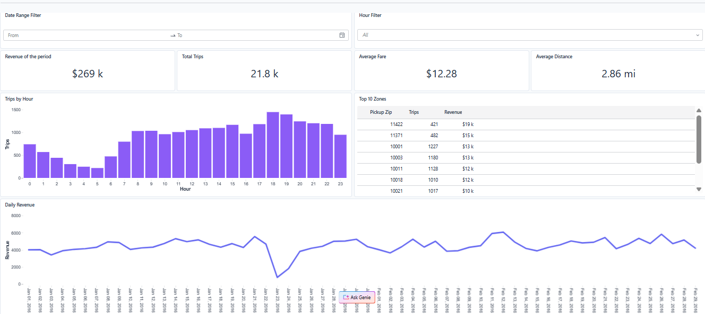

# NYC Taxi Analytics — Databricks Lakehouse Demo

Proyecto end-to-end de análisis de viajes de taxi en NYC usando 
Databricks Free Edition y arquitectura medallion (Bronze / Silver / Gold).

## 📊 Dashboard



## 🛠️ Stack

- **Databricks Free Edition** (Serverless compute)
- **Delta Lake** (formato de tabla con ACID + time travel)
- **Databricks SQL**
- **AI/BI Dashboards** (visualización nativa)

## 🏗️ Arquitectura Medallion

**Bronze** (`trips_bronze`)  
Ingesta cruda desde `samples.nyctaxi.trips`, sin transformaciones. 
Source of truth, permite reprocesar las capas superiores si cambia la lógica.

**Silver** (`trips_silver`)  
Datos limpios y enriquecidos: filtrado de outliers (fares negativos, 
distancias en cero, viajes con timestamp inválido) y columnas derivadas 
(duración del viaje en minutos, hora y fecha del pickup).

**Gold** (`daily_metrics`, `hourly_patterns`)  
Agregaciones de negocio listas para consumo en dashboards: métricas 
diarias y patrones horarios.

## ❓ Preguntas de negocio respondidas

1. ¿Cómo evoluciona el revenue diario a lo largo del período?
2. ¿Cuáles son las horas más rentables por día de la semana?
3. ¿Qué zonas (por ZIP code) generan más demanda y revenue?
4. ¿Cuáles son las rutas origen-destino más frecuentes?

## 📁 Estructura del repo

```
├── notebooks/
│   ├── 01_bronze.sql      # ingesta cruda
│   ├── 02_silver.sql      # limpieza y enriquecimiento
│   ├── 03_gold.sql        # agregaciones de negocio
│   └── 04_analysis.sql    # queries de análisis (window functions, CTEs)
├── dashboard/
│   └── dashboard_overview.png
└── README.md
```

## ▶️ Cómo correrlo

1. Crear schema en Databricks: `CREATE SCHEMA workspace.taxi_demo;`
2. Ejecutar los notebooks en orden: `01 → 02 → 03 → 04`
3. Replicar el dashboard apuntando a las tablas gold

## 🔍 Decisiones técnicas

- **Por qué medallion**: separar raw, limpio y agregado permite 
  reprocesar capas superiores si la lógica de negocio cambia, sin 
  tener que volver a ingestar desde la fuente.
- **Por qué Delta Lake**: ACID transactions, schema enforcement y 
  time travel para auditar cambios.
- **Filtrado de outliers en Silver**: fares > $500 y trip_distance = 0 
  distorsionan los promedios de las tablas gold y los dashboards.

---
*Proyecto personal de exploración de Databricks.*
